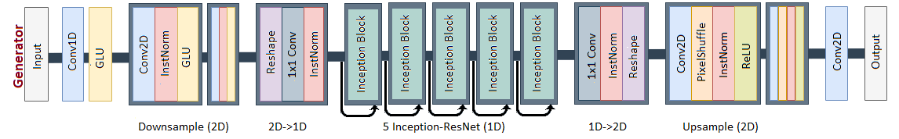
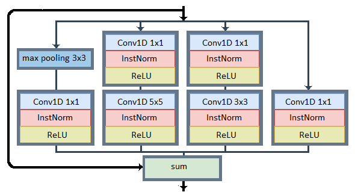
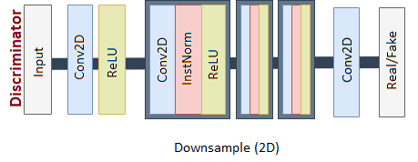

# ICRCycleGAN-VC
<p align="justify">

This is the official <strong>ICRCycleGAN-VC</strong> implementation repository with PyTorch.<br/><br/>

Due to the results and poor performance of voice conversion models in Persian VC, we proposed <strong>ICRCycleGAN-VC</strong>, which is implemented with careful attention to the structure of Persian speech. This is the last method for non-parallel audio conversion using CycleGAN-VC. This context-independent method is based on cycle adversarial generative networks and uses the Inception-ResNet module in the cyclic structure to extract features through different filters in parallel. The depth of this method is less than other CycleGAN-VC methods, especially MaskCycleGAN-VC. The performance of this method in <strong>Persian and English VC</strong> is excellent compared to the previous methods.
</p>
<p align="center">
<br><br><br><br>

<br>
<b>Figure1: ICRCycleGAN-VC Generator Architecture</b>
<br><br><br><br>
</p>

<p align="center">

<br>
<b>Figure2: Inception-ResNet Blocks in Generator</b>
<br><br><br><br>
</p>

<p align="center">

<br>
<b>Figure3: ICRCycleGAN-VC Discriminator Architecture</b>
<br>
</p>


## Setup

Clone the repository.

```
git clone https://github.com/nafiuny/ICRCycleGAN-VC.git
cd ICRCycleGAN-VC
```

Create the conda environment.
```
conda env create -f environment.yml
conda activate ICRCycleGAN-VC
```
## Dataset
We used FarsDat dataset for tests in Persian language and VCC2018 for English VC.<br/>
You can customize your training and testing with other datasets. The data structure should be as follows:<br/>
```
VCC2018/VCC2018_evaluation
├── VCC2SF1
│   ├── 10001.wav
│   ...
|   ...
└── VCC2SM2
    ├── 10001.wav
    ...
    
VCC2018/VCC2018_training
├── VCC2SF1
│   ├── 10001.wav
│   ...
│   ...
└── VCC2SM2
    ├── 10001.wav
    ...
```    
Download the <strong>VCC2018 dataset</strong> from this command line. We need two male and two female speakers and at least 10 wavs files for each.
```
wget --no-check-certificate https://datashare.ed.ac.uk/bitstream/handle/10283/3061/vcc2018_database_training.zip?sequence=2&isAllowed=y
wget --no-check-certificate https://datashare.ed.ac.uk/bitstream/handle/10283/3061/vcc2018_database_evaluation.zip?sequence=3&isAllowed=y
wget --no-check-certificate https://datashare.ed.ac.uk/bitstream/handle/10283/3061/vcc2018_database_reference.zip?sequence=5&isAllowed=y
```

Unzip the dataset file.
```
mkdir vcc2018
apt-get install unzip
unzip vcc2018_database_training.zip?sequence=2 -d vcc2018/
unzip vcc2018_database_evaluation.zip?sequence=3 -d vcc2018/
unzip vcc2018_database_reference.zip?sequence=5 -d vcc2018/
mv -v vcc2018/vcc2018_reference/* vcc2018/vcc2018_evaluation
rm -rf vcc2018/vcc2018_reference
```

## preprocess

To expedite training, we preprocess the dataset by converting waveforms to melspectograms, then save the spectrograms as pickle files `<speaker_id>normalized.pickle` and normalization statistics (mean, std) as npz files `<speaker_id>_norm_stats.npz`. We convert waveforms to spectrograms using a [melgan vocoder](https://github.com/descriptinc/melgan-neurips) to ensure that you can decode voice converted spectrograms to waveform and listen to your samples during inference.

```
python data_preprocessing/preprocess_vcc2018.py \
  --data_directory vcc2018/vcc2018_training \
  --preprocessed_data_directory vcc2018_preprocessed/vcc2018_training \
  --speaker_ids VCC2SF1 VCC2SF2 VCC2SM1 VCC2SM2
```

```
python data_preprocessing/preprocess_vcc2018.py \
  --data_directory vcc2018/vcc2018_evaluation \
  --preprocessed_data_directory vcc2018_preprocessed/vcc2018_evaluation \
  --speaker_ids VCC2SF1 VCC2SF2 VCC2SM1 VCC2SM2
```


## Train

Train ICRCycleGAN-VC to convert between `<speaker_A_id>` and `<speaker_B_id>`. You should start to get excellent results after only several hundred epochs.
```
python -W ignore::UserWarning -m icr_cyclegan_vc.train \
    --name icr_cyclegan_vc_<speaker_id_A>_<speaker_id_B> \
    --seed 0 \
    --save_dir results/ \
    --preprocessed_data_dir vcc2018_preprocessed/vcc2018_training/ \
    --speaker_A_id <speaker_A_id> \
    --speaker_B_id <speaker_B_id> \
    --epochs_per_save 100 \
    --epochs_per_plot 10 \
    --num_epochs 100000 \
    --batch_size 1 \
    --generator_lr 2e-4 \
    --discriminator_lr 1e-4 \
    --decay_after 1e4 \
    --sample_rate 22050 \
    --num_frames 64 \
    --max_mask_len 25 \
    --gpu_ids 0 \
```

To continue training from a previous checkpoint in the case that training is suspended, add the argument `--continue_train` while keeping all others the same. The model saver class will automatically load the most recently saved checkpoint and resume training.

Launch Tensorboard in a separate terminal window.
```
tensorboard --logdir results/logs
```

## Convert

Test your trained ICRCycleGAN-VC by converting between `<speaker_A_id>` and `<speaker_B_id>` on the evaluation dataset. Your converted .wav files are stored in `results/<name>/converted_audio`.

```
python -W ignore::UserWarning -m icr_cyclegan_vc.test \
    --name icr_cyclegan_vc_VCC2SF2_VCC2TF1 \
    --save_dir results/ \
    --preprocessed_data_dir vcc2018_preprocessed/vcc2018_evaluation \
    --gpu_ids 0 \
    --speaker_A_id VCC2SF2 \
    --speaker_B_id VCC2TF1 \
    --ckpt_dir results/mask_cyclegan_vc_VCC2SF2_VCC2SF1/ckpts \
    --load_epoch 500 \
    --model_name generator_A2B \
```

Toggle between A->B and B->A conversion by setting `--model_name` as either `generator_A2B` or `generator_B2A`.

Select the epoch to load your model from by setting `--load_epoch`.

## Code Organization
```
├── README.md                       <- Top-level README.
├── environment.yml                 <- Conda environment
├── .gitignore
├── LICENSE
|
├── args
│   ├── base_arg_parser             <- arg parser
│   ├── train_arg_parser            <- arg parser for training (inherits base_arg_parser)
│   ├── cycleGAN_train_arg_parser   <- arg parser for training ICRCycleGAN-VC (inherits train_arg_parser)
│   ├── cycleGAN_test_arg_parser    <- arg parser for testing ICRCycleGAN-VC (inherits base_arg_parser)
│
├── bash_scripts
│   ├── icr_cyclegan_train.sh      <- sample script to train ICRCycleGAN-VC
│   ├── icr_cyclegan_test.sh       <- sample script to test ICRCycleGAN-VC
│
├── data_preprocessing
│   ├── preprocess_vcc2018.py       <- preprocess VCC2018 dataset
│
├── dataset
│   ├── vc_dataset.py               <- torch dataset class for ICRCycleGAN-VC
│
├── logger
│   ├── base_logger.sh              <- logging to Tensorboard
│   ├── train_logger.sh             <- logging to Tensorboard during training (inherits base_logger)
│
├── saver
│   ├── model_saver.py              <- saves and loads models
│
├── icr_cyclegan_vc
│   ├── model.py                    <- defines ICRCycleGAN-VC model architecture
│   ├── train.py                    <- training script for ICRCycleGAN-VC
│   ├── test.py                     <- training script for ICRCycleGAN-VC
│   ├── utils.py                    <- utility functions to train and test ICRCycleGAN-VC

```

